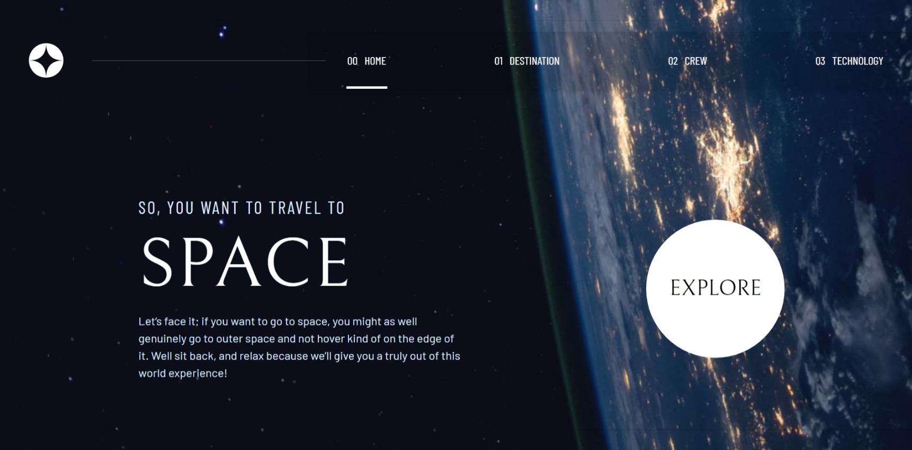

# Frontend Mentor - Space tourism website solution

This is a solution to the [Space tourism website challenge on Frontend Mentor](https://www.frontendmentor.io/challenges/space-tourism-multipage-website-gRWj1URZ3). Frontend Mentor challenges help you improve your coding skills by building realistic projects. 

## Table of contents

- [Table of contents](#table-of-contents)
- [Overview](#overview)
  - [The challenge](#the-challenge)
  - [Screenshot](#screenshot)
  - [Links](#links)
- [My process](#my-process)
  - [Built with](#built-with)
  - [What I learned](#what-i-learned)
  - [Continued development](#continued-development)
  - [Useful resources](#useful-resources)
- [Author](#author)

## Overview

### The challenge

Your challenge is to build out this multi-page space tourism website and get it looking as close to the design as possible.

**This project is a collaboration between us, Scrimba, and Kevin Powell. If you'd like to see how Kevin would tackle the project, you can [follow along on Scrimba's free course](https://scrimba.com/learn/spacetravel).**

Users should be able to:

- View the optimal layout for each of the website's pages depending on their device's screen size
- See hover states for all interactive elements on the page
- View each page and be able to toggle between the tabs to see new information

### Screenshot

> Image preview of diffrent pages in diffrent screen sizes are available in the `preview_images/` folder.

### Links

- [Solution URL](https://www.frontendmentor.io/solutions/responsive-space-tourism-web-page-using-tailwind-css-doEIIsFgMl)
- [Live Site URL](https://adhik-6.github.io/Space_Tourism/)

## My process

### Built with

- Semantic HTML5 markup
- CSS custom properties
- Flexbox
- CSS Grid
- Mobile-first workflow
- [Tailwind-CSS](https://tailwindcss.com/) - CSS Framework

### What I learned

I learnt how to use :
  - The ::before and ::after pseudo element
  - Flexbox and Grid in Tailwind
  - fetch API in Javascript along with an async function
  - Responsive images 

### Continued development

In future I want to add a smooth scrolling transition to the sidebar in mobile view and the active states of the button.

### Useful resources

- [Google Fonts](https://fonts.google.com/) - Google fonts is a great library that contains various fonts and icons. I got the required fonts for my projects from here.
- [Blackbox AI](https://www.blackbox.ai/) - I used Blackbox AI for quick refrences of various concepts and also to debug and troubleshoot my code sometimes.

## Author

Frontend Mentor - [@Adhik-6](https://www.frontendmentor.io/profile/Adhik-6)
